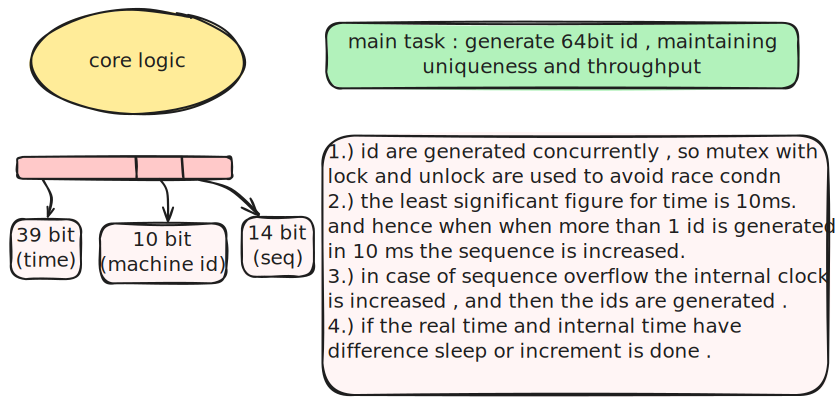
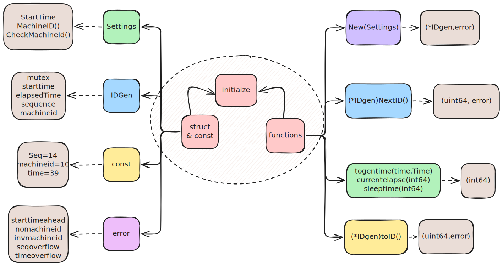
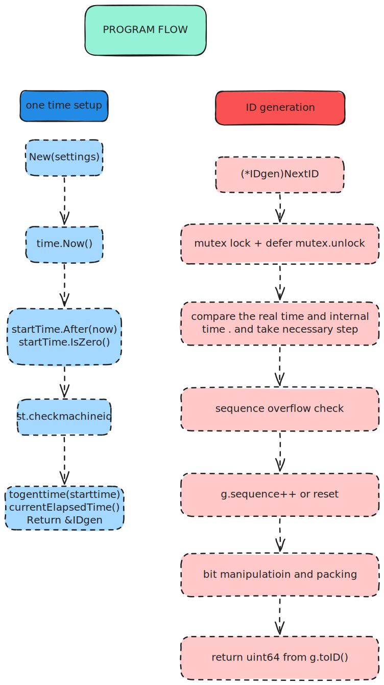

# The Project is to demonstrate , the core working of Snowflake-algorithm (used in backend system of x.com)
# it does not contain any frontend component , the package main.go can be imported and used per user's-interest 

# Content

- [Core Logic](#core-logic)
- [Initialize](#initialize)
- [Program Flow](#program-flow)
- [expected query](#expected-query)
- [References/credits](#referencescredits)

## Core Logic

## Initialize

## Program Flow

## expected query
1.) why sequence overflow , moves time forward ?

Sequence overflow could be tackled in 2 ways :
i ) after generating 2^14 ~ 16k ids in 10 ms , the system cant generated more than that , since only 14 bits are allowed , hence we could wait for the next 10ms to start . For example our code generated 16k ids in 1 ms , now the system could wait for 9 ms then generate the next batch . 
ii) now this is the method implemented in code , which cause time to move (Burst generation) : for example there is 160k id request in 1 ms . now we could generate 16k first then generate the next 16k , but before that we move the timer 10ms ahead , to make the id unique we do this similarly for other batch , and now 160 k unique ids are generated . but now there is a time difference which would be neutralized by sleep once the cpu is free . 

## References/credits

- [Snowflake ID - Wikipedia](https://en.wikipedia.org/wiki/Snowflake_ID)
- [YouTube: Distributed ID Generation](https://www.youtube.com/watch?v=g3BV_holJK4)
- [YouTube: Snowflake algorithm](https://www.youtube.com/watch?v=aLYKd7h7vgY)
- Code assistant : [Supermaven](https://github.com/supermaven-inc/supermaven-nvim) -  (nvim plugin)
- Copilot Claude Sonnet 4 - For learning Go concepts deeply (structs, pointers, references)
- [Excalidraw Obsidian Plugin](https://github.com/zsviczian/obsidian-excalidraw-plugin) - SVG generation
